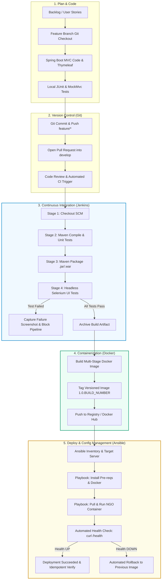

# DevOps Lifecycle Architecture & Flow Diagram

This document illustrates the end-to-end continuous integration, continuous testing, containerization, and configuration management lifecycle for the **NGO Project Progress Dashboard**.

---

## 1. DevOps Lifecycle Diagram (Mermaid)

---

## 2. Stage Breakdown & DevOps Principles

| Stage | Tooling | DevOps Principle | Quality Gate Criteria |
| :--- | :--- | :--- | :--- |
| **Plan & Track** | GitHub Projects / Kanban | Agile Transparency & WIP Limits | Definition of Ready satisfied. |
| **Code & Commit** | Git, Java 21, Spring Boot | Version Control & Traceability | Conventional commits (`feat:`, `fix:`). |
| **Continuous Integration** | Jenkins, Maven | Fast Feedback Loop | Clean build, zero compiler warnings. |
| **Automated Testing** | JUnit 5, Selenium, Chrome | Quality Gating | 100% test pass rate; screenshot on failure. |
| **Containerization** | Docker, Docker Compose | Immutable Infrastructure | Minimal image size, unprivileged runner. |
| **Config Management** | Ansible | Idempotency & Infrastructure as Code | Second playbook run reports `changed=0`. |
| **Monitoring & Rollback** | Spring Actuator, Curl | High Availability & Resilience | `/health` returns 200; automated tag rollback. |
