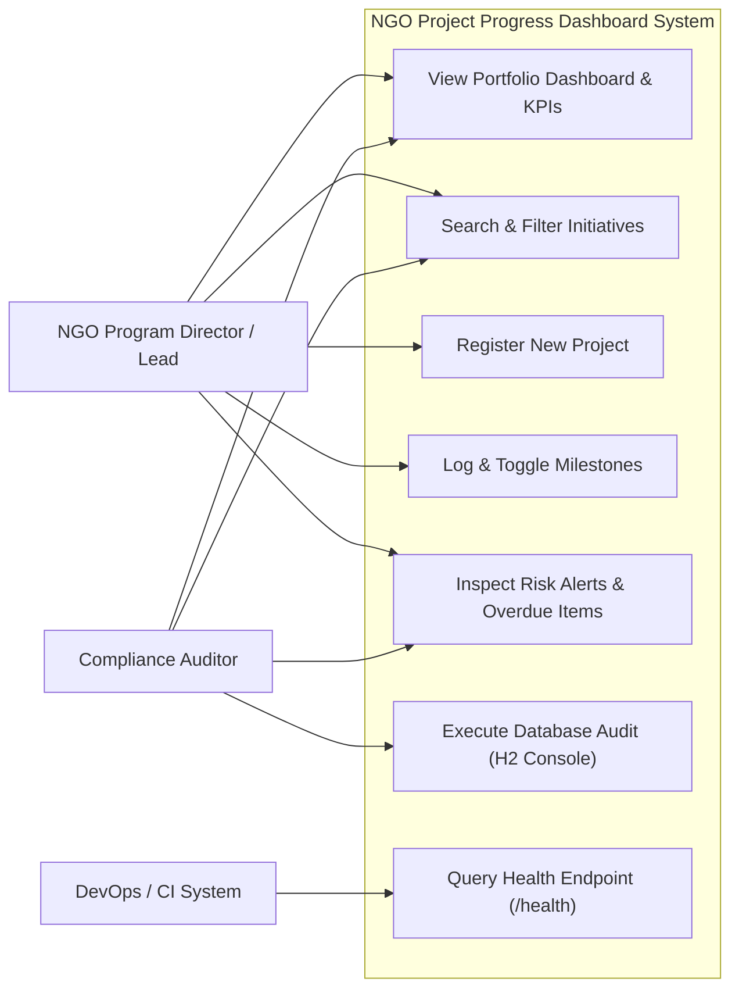
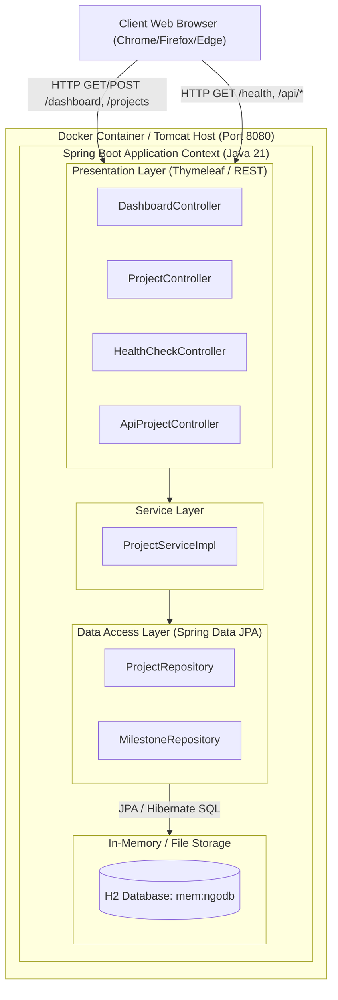
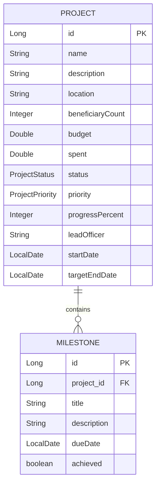

# Software Requirements Specification (SRS) & Architecture

## 1. System Overview
The **NGO Project Progress Dashboard** is a multi-tier enterprise web application developed with Java 21, Spring Boot 3, Thymeleaf, and Spring Data JPA over an embedded H2 database. It serves non-profit executives, field leads, and auditors to manage social welfare projects, track milestones, calculate real-time completion velocity, and trigger proactive risk alerts.

---

## 2. Functional Requirements
1. **FR-1 (Dashboard & KPIs):** Compute and display aggregate metrics: Total Projects, Completed, In-Progress, Delayed, Beneficiary Count, Total Budget, and Total Expenditure.
2. **FR-2 (Initiative Management):** Create, update, view, and delete project entities with validation on budgets, deadlines, and ownership.
3. **FR-3 (Milestone Log):** Support one-to-many relationship where each project has ordered milestones with completion toggling and dynamic project progress recalculation.
4. **FR-4 (Search & Filter):** Instant query filtering across project names, geographical regions, and lead officers, plus status filtering.
5. **FR-5 (Risk & Alert Monitoring):** Automatically identify projects exceeding target deadlines (`OVERDUE`) and projects with low progress (< 50%) with fewer than 30 days remaining.
6. **FR-6 (DevOps Health & Observability):** Expose `/health` and Spring Actuator metrics (`/actuator/health`, `/actuator/info`) for container orchestration and Ansible checks.

---

## 3. Use-Case Diagram (Mermaid)

---

## 4. Software Architecture Diagram

---

## 5. Entity Relationship (ER) Data Model

---

## 6. API Endpoint Specification

| Method | Endpoint | Description | Response Type |
| :--- | :--- | :--- | :--- |
| `GET` | `/` or `/dashboard` | Executive KPI dashboard with active initiatives | `text/html` |
| `GET` | `/projects` | Filterable project directory | `text/html` |
| `GET` | `/projects/new` | Blank project registration form | `text/html` |
| `POST` | `/projects/save` | Create or update project with validation | `redirect:/projects` |
| `GET` | `/projects/{id}` | Project detail view with milestone tracker | `text/html` |
| `POST` | `/projects/{id}/milestones` | Append a new milestone to project | `redirect:/projects/{id}` |
| `POST` | `/projects/{pId}/milestones/{mId}/toggle` | Toggle milestone achieved status | `redirect:/projects/{pId}` |
| `GET` | `/alerts` | Dedicated risk & overdue alert center | `text/html` |
| `GET` | `/health` | DevOps JSON health check endpoint | `application/json` |
| `GET` | `/api/projects` | REST JSON list of all projects | `application/json` |
| `GET` | `/api/metrics` | REST JSON summary KPI metrics | `application/json` |
| `GET` | `/actuator/health` | Spring Boot Actuator health status | `application/json` |
