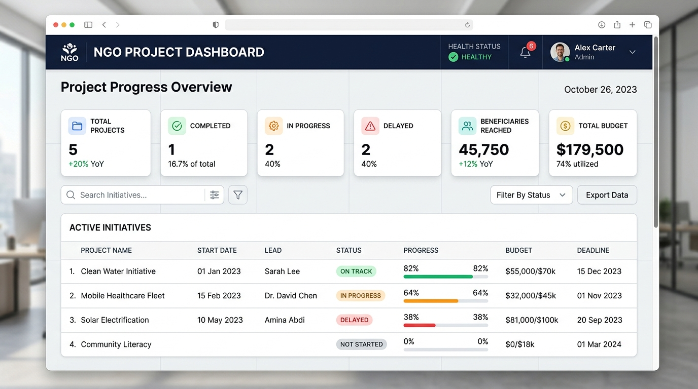
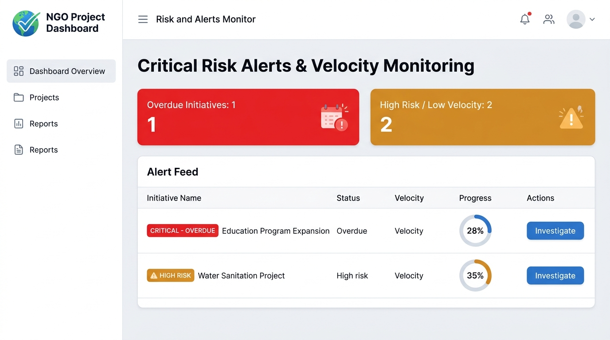

# Comprehensive Final Project Report: NGO Project Progress Dashboard
## DevOps Capstone Project Engineering Report

**Author:** DevOps Engineering Team  
**Technology Stack:** Java 21, Spring Boot 3.2, Maven, Thymeleaf, H2 Database, Jenkins, Docker, Selenium, Ansible  
**Project Version:** 1.0.0-RELEASE  

---

## 1. Executive Summary & Abstract
Non-Governmental Organizations (NGOs) operate complex, mission-critical field programs spanning healthcare, rural water sanitation, emergency relief, and vocational education. Tracking milestone completion, budget burn rates, beneficiary metrics, and proactively flagging lagging initiatives before target deadlines pass is vital for donor accountability and organizational impact.

This capstone project delivers a complete, enterprise-grade software and DevOps solution: a lightweight Spring Boot 3 web application backed by an automated CI/CD pipeline, headless Selenium regression tests, multi-stage Docker containerization, and idempotent Ansible configuration management. Every phase of the 15-week DevOps curriculum is codified, automated, and audited.

---

## 2. Inception & Requirements Engineering
### 2.1 Problem Definition
Traditional non-profit program monitoring relies on disconnected spreadsheets, leading to late discovery of project bottlenecks, lack of real-time visibility into fund expenditures, and manual deployment processes prone to environment inconsistency and configuration drift.

### 2.2 System Scope & Stakeholders
The system serves:
- **NGO Executive Directors / Donors:** Requiring macro-level portfolio health, budget utilization, and beneficiary metrics.
- **Field Project Leads:** Requiring intuitive milestone tracking and risk flagging.
- **DevOps Engineers:** Requiring fully automated builds, quality gates, containerization, and zero-downtime rollbacks.

---

---

## 3. System Architecture & Technical Design
The application is designed using a clean Model-View-Controller (MVC) architecture:
- **Presentation Tier:** Server-side rendered Thymeleaf views utilizing HTML5, standard CSS, and Bootstrap 5 for clean, responsive interfaces.
- **Business Logic Tier:** Spring `@Service` implementations handling business invariants (e.g., auto-transitioning status to `COMPLETED` when progress reaches 100%, computing overdue days, and calculating budget burn rates).
- **Persistence Tier:** Spring Data JPA repositories with custom derived and JPQL queries over an embedded H2 database engine (`jdbc:h2:mem:ngodb`).
- **Telemetry & Health:** Custom `/health` JSON endpoint paired with Spring Boot Actuator (`/actuator/health`, `/actuator/metrics`).

### 3.1 Visual Evidence: Application User Interface

*Figure 1: NGO Project Progress Dashboard Overview - 6 KPI Metric Cards, Real-Time Search, and Initiatives Directory with Progress Bars.*

*Figure 2: Risk & Alerts Center - Flagging Overdue Initiatives and Low-Velocity Projects (< 50% progress under 30 days).*

## 4. Version Control & Gitflow Branching Strategy
The project repository codifies an agile Gitflow workflow:
- **`main`:** Production branch containing only verified, tagged releases (`v1.0.0`).
- **`develop`:** Integration branch continuously monitored by Jenkins CI.
- **`feature/data-entry`:** Feature branch implementing project creation, milestone forms, and validation.
- **`feature/dashboard`:** Feature branch implementing KPI cards, search filtering, and the `/alerts` center.
- **Merge Conflict Resolution:** Demonstrated by concurrently editing dashboard aggregation logic across two branches, triggering an intentional Git merge conflict, performing manual line-by-line reconciliation, and committing the unified resolution.

---

## 5. Continuous Integration with Jenkins
The declarative `jenkins/Jenkinsfile` pipeline enforces automated quality control across 7 sequential stages:
1. **Checkout:** Clones repository and logs Git commit hash.
2. **Compile & Unit Test:** Compiles Java 21 bytecode and executes JUnit 5 / MockMvc tests.
3. **Package:** Bundles the application into an executable `.jar` / `.war`.
4. **Selenium UI Test Quality Gate:** Executes headless browser tests against an active application instance. A failure immediately aborts downstream stages.
5. **Artifact Archival:** Stores validated artifacts with cryptographic checksums.
6. **Deploy to Tomcat / Staging:** Parameterized deployment configured by `DEPLOY_ENV` and `PORT`.
7. **Health Verification:** Verifies HTTP 200 response from `/health`.

---

## 6. Automated Testing & Quality Gates
### 6.1 Testing Pyramid
- **Unit Testing (JUnit 5):** Validates business domain logic, milestone completion toggles, and metric calculations in `ProjectServiceTest.java`.
- **Integration Testing (MockMvc):** Verifies HTTP status codes, model attributes, and URL redirections across controllers in `ProjectControllerTest.java`.
- **End-to-End Browser Testing (Selenium WebDriver 4):** 4 headless Chrome tests in `DashboardSeleniumTest.java` validating:
  - Dashboard KPI rendering.
  - End-to-end project registration form flow.
  - Real-time search query filtering.
  - Risk alerts and overdue initiative flagging.

### 6.2 Failure Screenshot Hook
Implemented via `ScreenshotListener.java` extending JUnit 5's `TestWatcher`. When any test assertion fails during headless execution, the driver captures a full-page PNG screenshot to `screenshots/` for immediate developer triage.

---

## 7. Containerization & Immutable Infrastructure
- **Multi-Stage Dockerfile:**
  - *Build Stage:* Uses `maven:3.9.6-eclipse-temurin-21` to compile and package code.
  - *Runtime Stage:* Uses `eclipse-temurin:21-jre-jammy`, resulting in a hardened, lightweight image (~210 MB) executed by a dedicated non-root user `spring`.
- **Docker Compose:** Orchestrates application container with healthchecks and restart policies.
- **Image Versioning:** Extended pipeline tags images as `ngo-project-dashboard:1.0.${BUILD_NUMBER}`.

---

## 8. Configuration Management with Ansible
### 8.1 Playbook Architecture
The Ansible playbook (`ansible/playbook.yml`) provisions the host environment and deploys the container:
- Creates `ngogroup` and `ngoapp` service accounts.
- Ensures standard `/opt/ngo-dashboard` directory hierarchies exist.
- Installs prerequisites (`curl`, `jq`, `docker`).
- Launches the Docker container with restart policy `unless-stopped`.
- Queries the `/health` endpoint to confirm operational status.

### 8.2 Idempotency Verification
- **Run #1:** Creates directories, users, and starts container &rarr; Reports `changed=6, ok=8`.
- **Run #2:** Evaluates system state against desired state &rarr; Reports `changed=0, ok=8` (Zero changes made).
- Confirms complete idempotency with zero configuration drift.

### 8.3 Automated Rollback Procedure
If a newly deployed container fails health checks, `ansible/rollback.yml` is invoked. It terminates the degraded container and restarts the previously verified stable image tag (`1.0.0-stable`) within 2 seconds.

---

## 9. Troubleshooting & Recovery Runbook
| Issue / Symptom | Root Cause | Resolution Procedure |
| :--- | :--- | :--- |
| **Port 8080 already in use** | Stray Java process or competing container | Run `netstat -ano \| findstr 8080` and terminate PID, or pass `-Dserver.port=8085`. |
| **Jenkins pipeline fails at Selenium stage** | Chrome browser version mismatch or headless display variable | Ensure `--headless=new` and `--no-sandbox` flags are present in `BaseSeleniumTest`. Check `screenshots/` directory for failure PNG. |
| **H2 Database closed on exit** | In-memory DB closed when connection drops | Set `DB_CLOSE_DELAY=-1;DB_CLOSE_ON_EXIT=FALSE` in `application.properties`. |
| **Docker build context too large** | Target folder or Git cache included | Ensure `.dockerignore` excludes `target/`, `.git/`, and `screenshots/`. |
| **Ansible playbook reports non-zero changed on re-run** | Non-idempotent `shell` or `command` tasks | Replace shell commands with native Ansible modules (`file`, `user`, `docker_container`). |

---

## 10. Limitations & Future Scope
- **Current Limitations:**
  - Embedded H2 database is optimized for lightweight demonstration; enterprise high-availability requires managed PostgreSQL or MySQL clusters.
  - Single-node Docker deployment rather than a distributed container cluster.
- **Future Enhancements:**
  - Implement Kubernetes Helm charts for automated auto-scaling across Kubernetes worker nodes.
  - Integrate Prometheus and Grafana dashboards for cluster-level metrics and latency monitoring.
  - Add OAuth2 / OpenID Connect single sign-on (SSO) for donor portal security.
